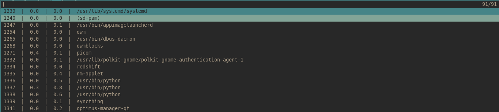

# List of sripts
1. dmenu-dict
2. dmenu-powermenu
3. dmenu-kill-ps
4. dmenu-scripts
5. dmenu-configs
6. dmenu-obs

## dmenu-dict
It's a dictionary for dmenu which use an online [API](https://dictionaryapi.dev/) :
```
https://api.dictionaryapi.dev/api/v2/entries/en_US/
```
The API provides definitions, examples and other things, but I only used synonyms in my use case.
The script copy the selected item to the clip board and also add it with this format ```word = selected synonym``` to my vocabulary file.

Dependencies:
- jq 
- curl
- dunst
- xsel

Search:


Result:


## dmenu-powermenu
Just a simple powermenu for dmenu.

Dependencies:
- [betterlockscreen](https://github.com/pavanjadhaw/betterlockscreen)


## dmenu-kill-ps
List user running process into dmenu and kill the selected item.

Dependencies:
- dunst



## dmenu-scripts
List my scripts directory config files in demnu and open the selected item in vim.


## dmenu-configs
List my ```~/.configs```directory config files in demnu and open the selected item in vim.


## dmenu-obs
Start and stop OBS-Studio recording.

Dependencies:
- dunst


# Fell free to clone or fork these scripts, also help me to improve them. :)
